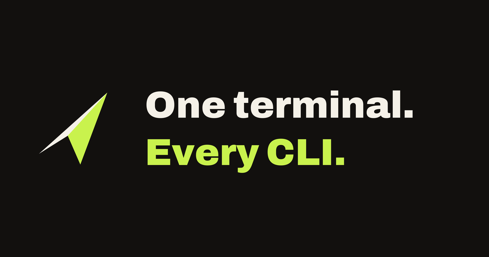

# Glider

**Multiple CLIs. One prompt.**

Type `/cursor-agent` at the end of a message in Claude Code. Glider runs the
task there, relays its permission prompts back to you, and returns the
answer — no reconfiguration, on a session already running.

```
fix the failing test in internal/foo /claude
summarize the last ten commits        /cursor-agent
refactor this module                  /agy
or open it in its own window          /claude:interactive
```

Claude Code, Cursor Agent and Antigravity (`agy`) are the three supported
today. A fourth is an entry in `configs/vendor_candidates.yaml` plus an
adapter — never a branch on a vendor name in shared code.

Glider is also a routing layer: it can send the CLIs' inference traffic to
local models or to your own cloud keys. That half is optional, and the table
below covers it.

---

## What it does

| Capability | Summary |
|---|---|
| **Cross-CLI delegation** | Send a prompt from your current CLI to another installed CLI (`/claude`, `/cursor-agent`, `/agy …`); Glider runs it headless and a clean final answer comes back — not the raw transcript. Flip to raw from the dashboard when debugging. `/vendor:interactive` hands the task to that CLI's own native session in a new window instead |
| **Permission relay** | Handing a task to a headless CLI normally means switching its permission prompts off. Glider detects when the delegate pauses for one, relays that prompt back to you, and resumes it on your answer |
| **Transparent OS-level interception** | Windows (WinDivert) and Linux (iptables + `SO_ORIGINAL_DST`): redirects a CLI's outbound HTTPS to Glider without the CLI cooperating (no env var, no proxy setting) — works even on a session that's already running. macOS not yet implemented |
| **NGL (Native Glider Language)** | A canonical `Turn`/`Part` envelope every vendor's wire format is translated through (outgoing), plus an `OriginAdapter` per vendor that recognizes and replies to that vendor's own live traffic (incoming) — so core routing/delegation code never branches on which CLI is talking. See [docs/site/ngl.html](docs/site/ngl.html) |
| **Dual-mode proxy** | Gateway (`:8080`, OpenAI-compatible BYOK) + HTTPS MITM forward proxy (`:8082`) that decrypts allowlisted CLI-cloud traffic |
| **Smart routing** | Explicit commands, turn-family sticky, task classifier, Starlark scripts, token ceiling — routes each request to local or cloud |
| **MCP integration** | GitHub tools via device-flow OAuth or PAT; extensible server registry |
| **Dashboard** | Real-time web UI: routing stats, VRAM/GPU, config editor, vendor registry, MCP servers, workspace browser — opens in its own native window (not a browser tab) via the tray, `127.0.0.1`-only |
| **Hot-reload** | Edit routing rules, model aliases, backends, thresholds, and log level without restarting |
| **Context graph** | Turn-indexed event store for sticky routing and analytics |
| **System tray** | Runs in the background (Windows) — "Open Dashboard" and "Exit" |

Glider does **not** hardcode behavior for any one CLI in its core routing/delegation code — everything vendor-specific lives behind two adapter boundaries (NGL wire format, `VendorAdapter` execution behavior). See [`planning/ngl_and_adapters.md`](planning/ngl_and_adapters.md).

---

## Quick start

> Full walkthrough: [docs/SETUP.md](docs/SETUP.md) · full prerequisite list: [docs/SETUP.md §0](docs/SETUP.md#0-prerequisites)

**To build:** Go 1.25+, Git, and — on Windows only — a C compiler, because the tray and the native window need `cgo`. Linux builds with `CGO_ENABLED=0` and needs no compiler.

**To delegate**, which is what most people are here for, you need one other agent CLI on `PATH` (`claude`, `cursor-agent` or `agy`) and nothing else. No certificate. No local model. Everything below is optional: Ollama for local routing, WinDivert or iptables for transparent interception, WebView2 for the dashboard's own window, Docker for the MCP stdio server.

```bash
# -H=windowsgui: Glider is a background tray app, not a CLI — this stops
# a console window from popping up behind the tray icon on launch.
go build -ldflags="-H=windowsgui" -o glider.exe ./cmd/glider
./glider.exe --config configs/glider.yaml
```

| Service | URL | Purpose |
|---|---|---|
| Gateway | `http://127.0.0.1:8080` | OpenAI-compatible endpoint |
| Dashboard | `http://127.0.0.1:8081` | Web UI |
| MITM proxy | `127.0.0.1:8082` | CLI `http.proxy` target (when MITM enabled) |

```bash
curl http://127.0.0.1:8080/healthz   # → ok
```

On Windows, Glider starts in the system tray — right-click the icon for **Open Dashboard** (native window) or **Exit**.

---

## How it works

```
CLI (Claude Code / Cursor Agent / agy)
       │
       ├── Gateway mode: Override Base URL → :8080/v1
       │       → resolve model alias → tokenize → route → transform → execute
       │
       └── MITM mode: http.proxy (or transparent WinDivert redirect) → :8082
               → TLS-decrypt allowlisted hosts → same pipeline, or origin passthrough
```

Both modes share one completion path (`PipelineCompleter`) that answers **which model/backend handles this request**. Routing priority (highest first): explicit `/local` `/cloud` `/heavy` `/fast` → turn-family sticky → tool-step re-decide → task classifier → Starlark scripts → token ceiling → default rule.

### Delegation (cross-CLI permission relay)

A message containing a flag like `do X /claude`, `do Y /cursor-agent`, or `do Z /agy` is claimed by a dedicated handler *before* normal routing — it never interferes with ordinary requests. The flag must come at the **end** of the message, not the start: some CLIs (Claude Code confirmed) treat a leading `/` as their own local slash command and never send the message at all if it starts with an unrecognized one — putting the flag last sidesteps that for every front. Recognizing this works the same way for whichever CLI you're typing *into*, not just the target — `internal/ngl`'s `OriginAdapter` per vendor is what makes that front-agnostic (see [docs/site/ngl.html](docs/site/ngl.html)). Glider then:

1. Runs the target CLI headless with that prompt (per-vendor `CommandTemplate`, data-driven — see `configs/vendor_candidates.yaml`, editable from the dashboard's **Vendors** tab) — or, with a trailing `:interactive` instead (`/agy:interactive`), opens that CLI's own native session in a new window with the task as its first message, and stops there (no capture, no relay).
2. Uses that CLI's `VendorAdapter` to detect a permission denial in its output.
3. Relays the denial back to you as the reply, with a one-shot resume token (`<token> /vendor:allow` / `<token> /vendor:deny`).
4. On allow, grants the permission (mechanism is vendor-specific — flag, or, for `agy`, its own settings file, written atomically) and resumes the same session.
5. A successful (non-denied) reply is rendered through `internal/ngl`'s `DelegateRenderer` — the vendor's own already-synthesized final answer, not its raw stream-json transcript — unless the dashboard's response-detail setting is switched to raw.

See [`planning/permission_relay_design.md`](planning/permission_relay_design.md) for the full design, including known limits.

---

## Configuration

Primary config: [`configs/glider.yaml`](configs/glider.yaml)

| Profile | File | Use case |
|---|---|---|
| Dual mode (default) | `configs/glider.yaml` | Gateway + MITM + dashboard |
| Pure local | `configs/glider.local.yaml` | Ollama only, no cloud fallback |
| Cloud-oriented | `configs/glider.cloud.yaml` | BYOK cloud bias, MITM off |

Cloud keys via env: `OPENAI_API_KEY`, `ANTHROPIC_API_KEY`. Copy [`.env.example`](.env.example) → `.env.local` for local credential loading.

**Hot-reload** (no restart): routing rules, model aliases, context threshold, log level, backend URLs/clients.
**Requires restart**: listen ports, MITM CA/hosts/transparent-interception settings.

---

## Architecture

| Package | Responsibility |
|---|---|
| `cmd/glider` | Entrypoint — wires all subsystems, tray |
| `internal/api` | OpenAI + Responses gateway, SSE streaming |
| `internal/mitm` | HTTPS MITM forward proxy (CONNECT, CA, transparent redirector — WinDivert on Windows, iptables on Linux, delegation handler) |
| `internal/vendors` | Vendor registry/discovery, headless CLI execution, permission-relay resume flow, workspace-per-PID resolution |
| `internal/ngl` | Native Glider Language — canonical `Turn`/`Part` envelope + per-vendor wire-format adapters |
| `internal/backend` | Ollama, vLLM, OpenAI, Anthropic clients |
| `internal/router` | Explicit / classifier / Starlark / tool_followup routing |
| `internal/orchestrator` | Lifecycle, queue, fallback chain, rate/budget, VRAM allocation, fan-out |
| `internal/tools` | Builtin tools (fs/git/web/artifacts) + MCP registry, workspace sandbox |
| `internal/dashboard` | Embedded web UI + REST API + WebSocket push |
| `internal/contextgraph` | Turn-family event graph (sticky routing + analytics) |
| `internal/procinfo` | PID/process-name resolution from a TCP connection (origin CLI identification) |
| `internal/tray` | System tray (Windows; no-op elsewhere) |
| `internal/webviewshell` | Native window for the dashboard (Windows; falls back to opening the default browser elsewhere) |
| `internal/config` | YAML load + file-watcher hot-reload |
| `internal/transform` | Tokenizer, context trim/augment |
| `internal/vram` | nvidia-smi GPU monitor + allocation strategy |
| `internal/metrics` | Route/token/cost/latency collector + event bus |
| `internal/mcp` | MCP server management (GitHub HTTP + stdio) |
| `internal/cursorrpc` | Cursor's Connect-RPC wire format (protobuf helpers, RunSSE encode) |
| `internal/procutil` | Suppresses console-window flashes from spawned subprocesses (Windows) |
| `internal/atomicfile` | Crash-safe file overwrite (temp file + rename) for config/settings writes |
| `internal/fileacl` | Windows ACL restriction for sensitive files (CA key, GitHub token) beyond what mode bits enforce |
| `internal/safego` | Panic-recovering goroutine launcher for long-running background loops |
| `internal/summarizer` | Adapts an inference backend to the summarizer interface used when compacting a continuity record |
| `internal/contextkit` | Session / episode / turn-budget state for swarm and loop runs |
| `internal/hotswap` | Registry of modules that can accept a new config without a restart (fan-out, backends, classifier) |
| `internal/runstate` | Detects whether the previous run exited cleanly — an unclean exit can leave redirector rules behind |
| `internal/plugin` | Plugin lifecycle and capability surface |

---

## Documentation

**Published at [utsv.work/Glider](https://utsv.work/Glider/).**

| Resource | Description |
|---|---|
| [docs/SETUP.md](docs/SETUP.md) | Step-by-step install, build, first run, CLI integration |
| [docs/CURSOR_CHECKLIST.md](docs/CURSOR_CHECKLIST.md) | Gateway / MITM verification checklist |
| [docs/MITM_NETWORK.md](docs/MITM_NETWORK.md) | MITM / transparent-interception networking detail |
| [docs/site/](docs/site/) | Hostable product docs — 13 pages. Start at [docs/README.md](docs/README.md) for the index |
| [docs/site/tutorial.html](docs/site/tutorial.html) | Walkthrough: empty machine to a cross-CLI handoff |
| [docs/site/configuration.html](docs/site/configuration.html) | Every config key with type, default and function |
| [docs/instructions.md](docs/instructions.md) | Auto-delegation template your CLI reads at startup |
| [planning/README.md](planning/README.md) | Design-doc index |

Serve `docs/site/` locally with `powershell -File scripts/serve-docs.ps1`, or via Glider's dashboard at `http://127.0.0.1:8081/docs/`.

This repo owns the pages; it does not host them. `utsv.work` is an apex custom domain on the website repo, [singhutsav5502/thoughts](https://github.com/singhutsav5502/thoughts), and GitHub Pages allows one repo per domain — so the public copy is a snapshot in that repo at `public/Glider/`, refreshed with `npm run sync:glider`. Edit the pages here; run the sync there to publish them.

---

## Tests

```bash
go test ./...
go test ./bench -bench=. -benchtime=1s
```

---

## Contributing

```bash
go test ./...
go vet ./...
staticcheck ./...   # go install honnef.co/go/tools/cmd/staticcheck@latest
go build -ldflags="-H=windowsgui" -o glider.exe ./cmd/glider
```

Windows and Linux are both first-class — the transparent redirector has a separate implementation on each, chosen by build tag — so a Windows-only test run does not cover the project. From a Windows checkout with WSL installed:

```powershell
powershell -ExecutionPolicy Bypass -File scripts\test-linux.ps1
```

It cross-compiles each package's test binary with `GOOS=linux` and runs those binaries in WSL, so Go does not need to be installed in the distribution. It found a real Linux-only failure the first time it ran.

By opening a pull request you agree to the [Contributor Licence Agreement](CLA.md): you keep your copyright, and you grant the maintainer the right to ship your contribution under PolyForm Noncommercial and, if it ever happens, under other terms as well. No such terms exist today; the grant only keeps the option open, because it cannot be added retroactively.

---

## License

[](https://polyformproject.org/licenses/noncommercial/1.0.0)

Glider © 2026 [Utsav Singh](https://utsv.work/), licensed under [PolyForm Noncommercial 1.0.0](LICENSE).

In short: use it, study it, change it, and share your changes — for any **noncommercial** purpose. Personal projects, hobby work, study and experiment are all fine, and so is use by a charity, school, public research body or government. What is not permitted is commercial use. The full terms are in [LICENSE](LICENSE); they are what governs, not this summary.

This is **not** an OSI-approved open source licence. The noncommercial term makes Glider source-available rather than open source, and that is deliberate.

Nothing here is for sale and no commercial licence is on offer today. If you want to use Glider commercially, get in touch with [Utsav Singh](https://utsv.work/) and we can talk about it.

---

*Route AI coding CLIs to local models when it's cheap, cloud when it matters — and let them ask you for permission without leaving your terminal.*
