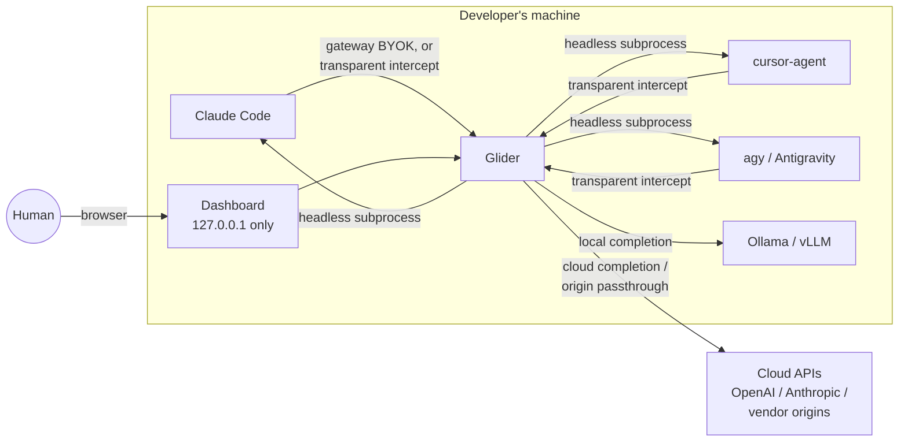
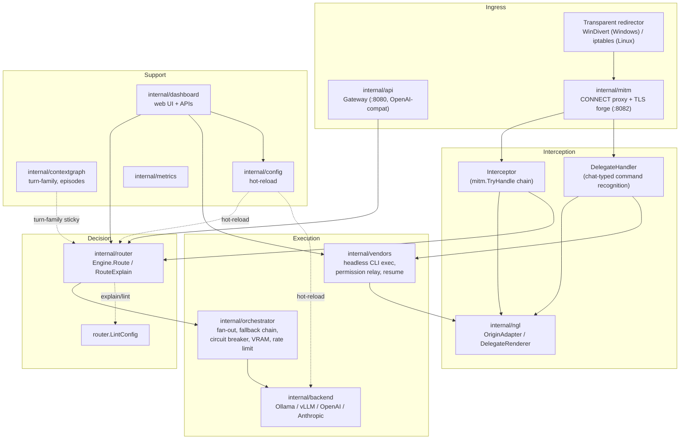

# Glider — High-Level Design

A system-level architecture reference: what Glider is, how its subsystems fit together, and how a request actually moves through it end to end. Deep design rationale for any one subsystem lives in its own `planning/*.md` doc (indexed in `planning/README.md`) or `docs/site/*.html`. This doc is the map between all of those, not a replacement for any of them.

## 1. What Glider is

A local-first routing, orchestration, and permission-relay layer for AI coding CLIs (Claude Code, cursor-agent, Antigravity/`agy`), running as a background process on the developer's own machine. It sits between those CLIs and the model backends they'd otherwise talk to directly — local (Ollama, vLLM) or cloud (BYOK OpenAI/Anthropic) — deciding per-request where a completion should actually run, and separately, letting a human delegate one CLI's task to another CLI (including relaying that CLI's own permission prompts back to the human) without leaving whichever tool they're already in.

Two structurally different interception mechanisms exist to get in front of that traffic without requiring any CLI's cooperation:

- **Cooperative**: a proxy setting or `ANTHROPIC_BASE_URL`-style override — a CLI has to be configured (or restarted) to use it.
- **Transparent**: OS-level packet/connection redirection (WinDivert on Windows, `iptables`+`SO_ORIGINAL_DST` on Linux) — works on a session that's *already running*, no CLI configuration at all.

Both converge on the same downstream pipeline once bytes reach Glider.

## 2. System context



Two loops worth noticing on this diagram: (a) Glider intercepts a CLI's outbound traffic *and* can spawn that same CLI (or a different one) as a headless subprocess — interception and delegation are separate mechanisms that happen to target the same processes; (b) the dashboard is a *client* of Glider's own HTTP server, not a separate service — one binary, one process, `127.0.0.1`-bound.

## 3. Component map



| Package | Responsibility | Depth reference |
|---|---|---|
| `internal/api` | OpenAI-compatible gateway (`:8080`), SSE streaming, the deliberately Claude-only `/v1/messages` route | `docs/site/api.html` |
| `internal/mitm` | HTTPS MITM: CONNECT proxy, CA/cert forging, both transparent redirector implementations, `DelegateHandler`, `Interceptor` | `docs/site/mitm.html`, `planning/transparent_redirector_design.md` |
| `internal/ngl` | Wire-format interop layer — recognizing/answering a vendor's own traffic, rendering delegate replies, structuring headless output | `planning/ngl_and_adapters.md`, `planning/ngl_and_adapters.md` |
| `internal/vendors` | Vendor registry/discovery, headless CLI execution, permission-relay resume flow, workspace-per-PID resolution, `VendorAdapter` (execution-layer per-CLI behavior) | `planning/permission_relay_design.md`, `planning/ngl_and_adapters.md` |
| `internal/router` | Rule-based routing engine (explicit/regex/context_size/always/script rules, task classifier, complexity scoring), `RouteExplain` dry-run, `LintConfig` | `docs/site/routing.html`, `planning/routing_and_context.md` |
| `internal/orchestrator` | Fan-out execution, fallback chains, circuit breakers, rate limiting, request queueing, VRAM allocation | — |
| `internal/backend` | Backend clients — Ollama, vLLM, OpenAI, Anthropic — and the model registry | — |
| `internal/contextgraph` / `internal/contextkit` | Turn-family event log, episode store, turn-family sticky routing signal | `planning/routing_and_context.md`, `planning/routing_and_context.md` |
| `internal/config` | Config loading, validation, hot-reload | — |
| `internal/dashboard` | Web UI (Overview, VRAM & Models, Rules Engine, MCP, Vendors, Workspace, Playground, Config) + its REST APIs | — |
| `internal/tools`, `internal/mcp` | Builtin tool registry, workspace sandbox, MCP server integration | `planning/tools.md` |
| `internal/tray`, `internal/webviewshell` | System tray (Windows), native dashboard window (WebView2) | — |
| `internal/procinfo`, `internal/procutil`, `internal/fileacl`, `internal/atomicfile` | Cross-cutting OS-level utilities: PID/process-name resolution, subprocess window suppression, Windows ACL hardening, crash-safe file writes | — |
| `internal/metrics` | Request-log event bus, history store, dashboard-facing stats | — |

## 4. Request flow walkthroughs

### 4a. Gateway request (cooperative path)

A CLI configured to use Glider's gateway (`http://127.0.0.1:8080/v1`) sends an OpenAI-compatible completion request.

```
CLI → internal/api (gateway) → internal/router.Engine.Route(req)
    → decision: {target: local|cloud, backend, model, reason}
    → internal/orchestrator (fallback chain wraps the call; circuit breaker
      per backend; VRAM allocator gates local model loads)
    → internal/backend (Ollama/vLLM/OpenAI/Anthropic client)
    → response streamed back through the same chain
```

`Engine.Route` evaluates a fixed dispatch order (see §5): explicit command override always wins first, regardless of any rule's configured priority; everything else is priority-sorted and returns on first match. `RouteExplain` (same package) runs the identical evaluation without the early return, for the dashboard's dry-run tooling (§7).

### 4b. Transparent interception → local fulfill or origin passthrough

```
CLI opens a real TLS connection to a vendor host (e.g. api.anthropic.com:443)
    → OS-level redirect (WinDivert packet rewrite, or iptables REDIRECT +
      SO_ORIGINAL_DST) lands the connection on Glider's transparent listener
      with zero CLI cooperation
    → Proxy.handleTransparent: peek SNI (or ResolveOriginalDestination),
      match against the configured host allowlist
    → allowlisted: mitmSession — forge a leaf cert, complete TLS, dispatch
      to DelegateHandler then Interceptor (first to claim the request wins)
    → not allowlisted: blindTunnel — raw byte relay, no decryption at all
```

Inside `mitmSession`, two local handlers get first refusal before anything reaches the real origin:

1. **`DelegateHandler`** — `ngl.ResolveOriginAdapter` recognizes whose traffic this is; if the human's extracted instruction ends in a registered delegate flag (`/vendor[:template]`), this *never* reaches the real origin at all — Glider runs the named vendor headlessly and synthesizes a reply in the front CLI's own wire shape.
2. **`Interceptor`** — for the small set of vendor RPC shapes Glider knows how to fulfill locally (Path A/B; see `docs/site/mitm.html`), attempts a local model completion; otherwise falls through to real origin passthrough, unmodified.

### 4c. Cross-CLI delegation (permission relay)

```
Human types "<prompt> /agy:headless" into (e.g.) Claude Code
    → DelegateHandler recognizes the flag, calls vendors.ResolveDelegate
    → template Mode is "headless", so ResolveDelegate calls RunWithOptions,
      which spawns agy as a subprocess and captures its stdout
    → agy's own tool call gets denied (needs a permission grant)
    → vendors.DetectDenials + RegisterPendingResume: a token is minted,
      keyed to {vendor, prompt, session_id, cwd, denials}
    → ngl.DelegateRenderer cleans agy's raw NDJSON down to a readable
      denial summary; DelegateHandler.WriteReply gets it on the wire in
      the FRONT CLI's (Claude Code's) own wire shape
    → Human replies "<token> /agy:allow" — same DelegateHandler path,
      "allow"/"deny" are reserved control-flow template names
    → ResolveDelegate grants the permission (VendorAdapter.GrantResumePermission,
      vendor-specific — a real settings.json write+revert for agy, a no-op
      for claude/cursor-agent), re-invokes agy's own "resume" template
    → agy's real answer comes back, rendered clean, in Claude Code's shape
```

The human never leaves Claude Code's own session for any of this — every reply arrives through whichever `OriginAdapter.WriteReply` implementation matches the CLI they're actually typing into, not the one being delegated to.

**The flag above is `/agy:headless`, not `/agy`, and that matters.** A `CommandTemplate` carries a `Mode`, and `ResolveDelegate` branches on it *before* `RunWithOptions` is ever reached: `"headless"` takes the path above; `"interactive"` goes to `resolveInteractive` → `LaunchInteractiveFunc`, which opens the vendor's own native session in a detached OS console window, primed with the task. Nothing is captured, relayed, or correlated back — the human drives that window directly. agy's `default` template is **interactive**, unlike claude's and cursor-agent's, because agy's headless mode auto-denies permission-gated tools and then frequently describes the workspace instead of acting on it (`configs/vendor_candidates.yaml` records the live reproductions). So a bare `/agy` opens a window; only `/agy:headless` produces the walkthrough above.

Do not confuse interactive Mode with **Path B** (`planning/permission_relay_design.md` §3, still unbuilt). Path B would pause a headless run mid-execution and relay the prompt back through the original session. Interactive Mode hands the human a separate terminal and ends Glider's involvement.

**Delegates run concurrently.** `PrepareContextDir` gives every run its own directory under `~/.glider/delegates/<id>/`, and no lock spans a run — so two delegates to the same vendor in the same workspace proceed side by side (pinned by `TestRunWithOptions_ConcurrentDelegatesDoNotShareContext`). Glider imposes no concurrency limit and does no fan-out of its own here; the *front* CLI decides to parallelise, dispatching one subagent per delegated task. This is orthogonal to §4d's orchestrator fan-out, which parallelises model calls, not delegate CLIs.

### 4d. Fan-out orchestration (flag-gated)

For a task the router or a human judges suitable for parallel decomposition, `internal/orchestrator`'s fan-out executor can dispatch multiple sub-tasks to multiple workers concurrently (VRAM-allocation-aware, with its own worker queue sizing — see `fanout.go`/`fanout_worker.go`), converging results back to one reply. Off by default; requires `orchestration.fan_out.enabled`.

## 5. Routing decision model

`internal/router.Engine.Route` evaluates, in this fixed order:

1. **Explicit command override** (`ExplicitCommandRule`, e.g. `/local`, `/cloud`) — matched anywhere in the message, not just the trailing token (a different, older convention than the vendor-delegate flags in §4c, which are deliberately trailing-only for the reason in `ngl_and_adapters.md`). **Always wins**, regardless of any rule's configured priority — enforced by `explicitHardOverride`, a hardcoded pre-pass before the general priority-sorted loop.
2. Everything else — `RegexRule`, `ContextSizeRule`, `AlwaysRule`, `StarlarkScriptRule`, `ComposerWrapupOriginRule`, plus two **injected** rule families built from `routing.task_classifier` (tools-present → cloud; must-cloud/small-local regex patterns) and `routing.complexity` (heuristic or Cursor-provided score vs. a threshold) — sorted by `Priority()` descending, first match wins.

`RouteExplain` (same `Engine`) runs the identical rule set without the early return, recording every rule's outcome — matched, shadowed by a higher-priority winner, or not matched — so the dashboard's Rules Engine → Explain panel can show *why* a real request would route where it did, without issuing a completion. `LintConfig` is a separate, static (no request needed) check for provable config-time ambiguity: two enabled rules racing on the same explicit command, or byte-identical triggers at the same priority that can never both be reached. Both are read-only reflections over the same rule construction `NewEngineFromConfig` does for the live gateway — never used on the real request path themselves.

Turn-family sticky continuity (`internal/contextgraph`) sits logically before the rule engine for follow-on turns within a ~90s window — a summary/title request immediately following an explicit `/cloud` turn inherits that decision rather than being independently re-evaluated, avoiding jittery mid-conversation flips.

## 6. Platform matrix

| Capability | Windows | Linux | macOS |
|---|---|---|---|
| Gateway (`:8080`) | ✅ | ✅ | ✅ |
| CONNECT-based MITM proxy (`:8082`) | ✅ | ✅ | ✅ |
| Transparent OS-level interception | ✅ WinDivert, live-verified | ✅ `iptables` REDIRECT + `SO_ORIGINAL_DST`, live-verified (WSL2 Ubuntu 24.04, kernel 6.6.87.2) | ❌ not implemented — `redirector_other.go` errors explicitly rather than silently no-opping |
| System tray | ✅ | — (no-op stub) | — (no-op stub) |
| Native dashboard window (WebView2) | ✅ | falls back to default browser | falls back to default browser |
| Windows ACL hardening (`internal/fileacl`) | ✅ | n/a (mode bits apply normally) | n/a |

Windows and Linux transparent interception are **architecturally different**, not the same mechanism with a different syscall set: WinDivert operates per-*packet* (Glider makes a redirect decision on every packet, including — until a 2026-07-30 fix — occasionally getting it wrong mid-connection); `iptables REDIRECT` operates per-*connection* (the kernel commits once, before Glider's listener ever sees anything), so the entire flow-sticky bug class that shape of bug belongs to is structurally impossible on Linux. See `planning/transparent_redirector_design.md` for the full comparison, including the real, more severe crash-safety risk Linux carries that Windows doesn't (persistent iptables state vs. a process-tied WinDivert handle).

## 7. Dashboard surface

Single-page app (`internal/dashboard/static/`), no build step, served via `embed.FS`, `127.0.0.1`-bound, no authentication (a removed `dashboard.auth` config field was found unwired to anything and deleted rather than left implying a security boundary that didn't exist).

| Tab | Backs onto |
|---|---|
| Overview | `internal/metrics` request log, live WebSocket feed |
| VRAM & Models | `internal/vram`, `internal/backend` model registry |
| Rules Engine | `internal/router` — rule editor, hot-swap module manager, **Config health** (`LintConfig`) and **Explain** (`RouteExplain`) panels |
| MCP | `internal/mcp` server registry, GitHub OAuth/PAT |
| Vendors | `internal/vendors` registry, permission presets, template editor |
| Workspace | Tools sandbox file browser |
| Playground | Live classification of chat-typed commands (delegate/workspace/allow-deny/routing-override) against the real parsers, plus guided lessons — teaches command syntax without executing anything |
| Config | Structured form + raw YAML editor over `internal/config`, hot-reloads most settings |

## 8. Cross-cutting concerns

**Config hot-reload**: most settings (rules, aliases, threshold, log level, backend/model clients) apply live via `config.Provider`'s watch mechanism; ports, MITM CA/hosts, and transparent-interception settings need a restart.

**Security posture**: dashboard's only real boundary is `127.0.0.1` binding (OS-login-boundary threat model, consistent with most local dev-tool dashboards — not currently defensible against another process running as the same OS user). CA private key and GitHub token get Windows ACL restriction beyond mode bits (`internal/fileacl`). All state-file writes (vendor registry, resume tokens, agy's own settings.json) go through `internal/atomicfile` (write-to-temp, rename) to survive a crash mid-write. `GODEBUG=http2debug` on the shared Glider process is explicitly banned (a real credential leaked into a debug log this way once) — `tools/wirecapture`, an isolated capture proxy, is the sanctioned alternative for frame-level protocol debugging.

**Third-party CLI ToS risk** (a real, current, non-hypothetical constraint on how this gets marketed/monetized — see the GTM discussion this doc's own history includes): Anthropic's February 2026 Consumer ToS update explicitly bans third-party access via extracted OAuth tokens, with active detection since; the delegate/permission-relay feature operates on a consumer CLI's own authenticated session in a way that's architecturally close to what that ToS targets. BYOK cloud routing and local-model routing carry none of this risk — they're normal API usage. This shapes what should be the headline-marketed feature vs. an opt-in, clearly-labeled one, not just a legal footnote.

**Observability**: every real routing decision is logged with its winning rule name and reason (`internal/metrics.Event.Rule`), visible in the Overview tab's request log — the *only* way to answer "why did this route where it did" for a real historical request, complementary to `RouteExplain`'s hypothetical dry-run.

## 9. Known gaps (as of this writing)

- macOS transparent interception unimplemented (§6) — `pfctl`/Network Extension framework designed, not built, no verifiable macOS environment to build and test it against.
- Dashboard has no real authentication or multi-user concept — single-operator, single-machine tool today. A P2P/team-pooling design (peers sharing local inference capacity, coordinated by a lightweight rendezvous service that never sees prompt/response content, Tailscale-shaped) is sketched in conversation history but not yet a written design doc or implementation.
- No cost/value reporting (`"$X saved by routing locally"`) — the raw local/cloud/canned split is tracked, never turned into a dollar figure.
- Adding a new vendor CLI requires writing Go (`OriginAdapter`, `DelegateRenderer`, `VendorAdapter`) — no path to community-contributed vendor support via config alone.
- `ngl.ParseXTurn` family has no live caller yet (`planning/ngl_and_adapters.md` §8) — built ahead of the orchestration feature that will need it.
- Router rule dispatch (`ResolveOriginAdapter`, `ResolveDelegateRenderer`, `Engine.Route`) is a linear scan/priority-sorted list — fine at today's scale (3 vendors, a handful of rules), a real bottleneck-in-waiting if either grows substantially.
