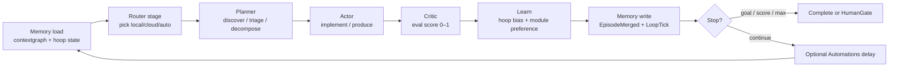

# Loop Engineering (canonical)

> **Status 2026-07-18.** Sources: [Addy Osmani – Loop Engineering](https://addyosmani.com/blog/loop-engineering/),
> [cobusgreyling/loop-engineering](https://github.com/cobusgreyling/loop-engineering)
> ([concepts](https://github.com/cobusgreyling/loop-engineering/blob/main/docs/concepts.md),
> [primitives](https://github.com/cobusgreyling/loop-engineering/blob/main/docs/primitives.md)).
>
> **This is not** “Cursor IDE `/loop` cron prompts” as the product definition.
> Scheduling is only one primitive (Automations). The core is **designing systems that
> prompt agents** — observe → plan → act → evaluate → learn — until a goal holds or a human gate fires.

Code: `internal/loop` (hoops), `internal/swarm` (parallel workers / hot-swap registry),
`internal/contextgraph` (durable memory spine), `internal/orchestrator` (harness runtime).

---

## 1. What Loop Engineering means (their vocabulary)

| Term | Meaning |
|------|---------|
| **Loop engineering** | Replace yourself as the person who prompts. Design the **system** that discovers work, assigns it, verifies results, persists state, and decides the next action. |
| **Recursive goal** | Define a purpose; the AI iterates (with sub-agents + external memory) until done or escalates to a human. |
| **Agent harness** | Environment for **one** agent run (tools, context, permissions). Glider’s gateway/MITM/`PipelineCompleter` is the harness. |
| **Loop (above harness)** | Harness **+** schedule/trigger **+** durable state **+** verification chain. Sits “one floor above” harness engineering (Osmani). |
| **Maker / checker** | Implementer must never grade its own homework; a separate verifier (often stronger model) scores “done”. |
| **Skills** | Persistent intent (`SKILL.md`) — pay down **intent debt** so each cycle does not re-guess conventions. |
| **Memory / state** | Durable spine outside the chat (`STATE.md`, Linear, Glider `contextgraph` + hoop state). Model forgets; repo/disk does not. |
| **Automations** | Heartbeat that fires discovery/triage on a cadence. Optional around the cycle — **not** the whole definition. |
| **Worktrees** | Isolate parallel agents so they do not collide. |
| **Sub-agents** | Role split: explore / implement / verify (orchestra). |
| **Connectors (MCP)** | Loop acts in real tools (tickets, PR, Slack), not only the filesystem. |
| **Autonomy L1→L3** | L1 report-only → L2 assisted fixes → L3 unattended (with gates, denylist, budget). |
| **Human gate** | Risky/ambiguous work escalates; safe allowlisted path may auto-act. |
| **Intent / comprehension / cognitive debt** | Missing intent → guesses; unread loop output → comprehension debt; walking away without judgment → cognitive surrender. |
| **Orchestration tax** | Human review bandwidth is the real ceiling on parallel loops. |

**Steinberger / Cherny:** design loops that prompt agents; the job is writing loops, not single prompts.

**Factory model:** pipelines + agents + checks + handoffs. Loop engineering operates the factory floor.

---

## 2. Glider map (honest)

| Loop Engineering primitive | Glider surface | Status |
|----------------------------|----------------|--------|
| **Harness** (single run) | `PipelineCompleter` Complete / CompleteLocal; local Ollama/vLLM + BYOK cloud | **Done** |
| **Memory / state** | `contextgraph` events + hoop `LoopState` under `~/.glider/loops/`; episodes via `contextkit` | **MVP** |
| **Router / which model·tools** | Explicit + classifier + Starlark + ceiling; per-stage `Route` on hoop modules | **MVP** |
| **Sub-agents (maker/checker)** | Hoop stages: **Planner → Actor → Critic**; Critic produces **eval score** | **MVP** |
| **Skills** | `skill` field / YAML hoop mirror; future SKILL.md load | **Partial** |
| **Swarm / parallel workers** | `internal/swarm` FanOut + dashboard swarm run | **Foundation** |
| **Worktrees** | Not Glider-owned yet (agent/tool side); document as future | **Todo** |
| **Hot-swap stages** | Compose Planner/Actor/Critic/Memory/Router modules; `swarm.Registry` ModuleLoop | **MVP** |
| **Automations (schedule)** | Optional `interval` / `cron` **around** cycles — secondary | **MVP** |
| **Self-learning (hoop learning)** | Eval scores + outcomes → local bias / stage route preference (config-gated) | **MVP** |
| **Connectors (MCP)** | Path A tools / Cursor MCP; Glider does not yet own MCP runtime for hoops | **Partial** |
| **Human gate** | Autonomy L1 default; escalate status on low critic score when gated | **MVP** |
| **Cursor IDE `/loop`** | Optional future wake into same hoop runner — **not** the product center | Deferred |

**Pure local:** default hoop `route: local`, `fail_policy: stop` (or escalate off). Loop runner talks to the gateway harness only — **no Cursor subscription** required for the hoop itself. Need a healthy local backend (Ollama/vLLM).

---

## 3. Anatomy of a Glider hoop cycle



**Iteration record** (persisted): stage results, latency, route, token estimate, **eval_score**, success, episode ids, context turn id.

---

## 4. API (dashboard)

| Method | Path | Purpose |
|--------|------|---------|
| GET | `/api/loops` | List hoop states |
| POST | `/api/loops` | Create hoop (goal + stages; schedule optional) |
| GET/PUT/DELETE | `/api/loops/{id}` | Read / update / delete |
| POST | `/api/loops/{id}/start` | Run cycles until stop |
| POST | `/api/loops/{id}/stop` | Cancel |
| GET | `/api/loops/modules` | Catalog of stage kinds + defaults (compose UI) |

YAML mirrors under `~/.glider/hoops/*.yaml` (kind: `hoop`).

---

## 5. How to create a self-learning hoop (UI)

1. Open Dashboard → **Hoops** panel (`http://localhost:8081`).
2. Set **Goal** (recursive purpose), prefer **Route = local** for pure-local.
3. Enable **Learning** (hoop learning MVP).
4. Optionally pick/customize stages: Planner / Actor / Critic (and Memory/Router bindings).
5. Optional: set Interval only if you want an Automations heartbeat between cycles.
6. **Create hoop** → **Start**. Watch iteration cards for eval scores and local bias.
7. Hot-swap: enable/disable related modules under **Hot-swap modules**; stage prompts can be edited via PUT `/api/loops/{id}` when stopped.

Config gate:

```yaml
orchestration:
  loops:
    enabled: true
    default_route: local
    hoop_learning:
      enabled: true
      local_bias_step: 0.05
      max_bias: 0.5
      window: 20
```

---

## 6. Interfaces for siblings (swarm / context / hot-swap)

| Package | Contract |
|---------|----------|
| `loop.Completer` | `Complete` / `CompleteLocal` — implemented by `orchestrator.PipelineCompleter` |
| `loop.Manager` | CRUD + Start/Stop; owns hoop persistence |
| `contextgraph.Store` | Append `LoopStarted` / `LoopTick` / `LoopStopped` / stage attrs; turn id `loop:{id}` |
| `swarm.Registry` | `ModuleLoop` / `ModuleSwarm` hot Apply — do not rebuild MITM here |
| `swarm.FanOut` | Parallel **Actor** workers for one iteration (optional future binding) |
| `contextkit.Episode` | Critic summary + tokens after each cycle |

Do **not** redefine scheduling as Loop Engineering. Keep Automations as an optional field on the hoop.

---

## 7. Non-goals / caveats (from sources)

- Verification remains on the human for anything that ships.
- Token cost can explode with planner+actor+critic every cycle — prefer local Critic for pure-local.
- Comprehension debt grows if you never read hoop output.
- L3 unattended without denylist/budget/gates is unsafe; Glider MVP defaults to L1-ish (report + score, fail_policy stop).

---

## 8. Related docs

| Doc | Role |
|-----|------|
| [swarm_orchestration.md](./swarm_orchestration.md) | FanOut, hot-swap, concurrency |
| [context_management.md](./context_management.md) | contextgraph memory spine |
| [smart_routing_and_local_tools.md](./smart_routing_and_local_tools.md) | Router inside the cycle |
| [README.md](./README.md) | Backlog index |
