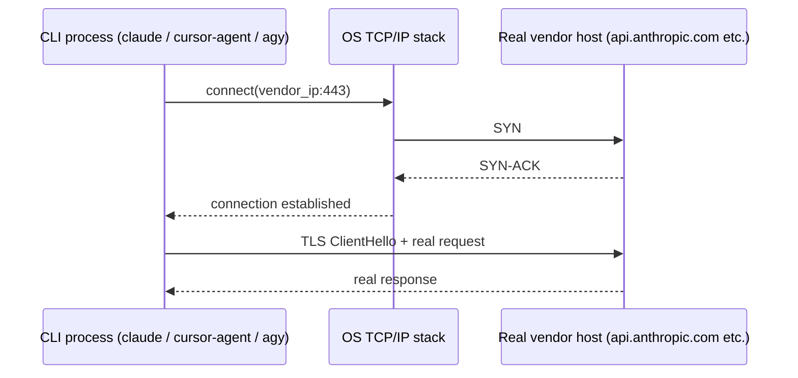
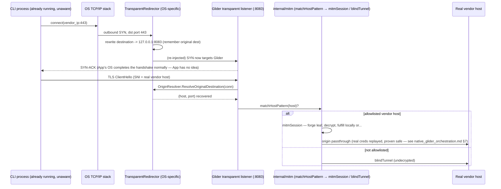

# The transparent redirector: interface design, mechanics, and diagrams

> **Status (2026-07-26):** Design doc for the interface boundary decided in [native_glider_orchestration.md](./native_glider_orchestration.md) §7 ("Scope decision: build Windows first, but behind an interface Linux/macOS can satisfy without touching core"). That entry is the decision; this doc is the depth behind it — full mechanics, diagrams, and the reasoning for exactly where the seam sits. Grounded in two live spikes run on 2026-07-26: a WinDivert sniff-mode capture (712 real TLS segments, system-wide, zero app cooperation — see below) and a WSL2 `iptables` REDIRECT attempt that hit a real, documented environment limit (also below).
>
> Related: [agent_cli_interop.md](./agent_cli_interop.md) (the "vendor packs, not Go switch statements" philosophy this doc's interface split deliberately mirrors) · `internal/mitm/proxy.go` (`handleCONNECT`, `mitmSession`, `blindTunnel` — the existing engine this interface feeds, unchanged) · `internal/mitm/hosts.go` (`matchHostPattern` — reused unchanged) · `docs/MITM_NETWORK.md` (the CONNECT-based path this generalizes)

---

## 0. The one-paragraph mental model

Every existing way Glider gets in front of traffic today — Cursor's `http.proxy` setting, a gateway base-URL override — works because the client **agrees to ask Glider first**. That's a favor, not a guarantee, and Claude Code proved both halves of that in one afternoon: it *does* grant the favor (`ANTHROPIC_BASE_URL` genuinely redirects it), and the favor is still the wrong thing to depend on, because it only takes effect for a process that hasn't started yet. A transparent redirector doesn't ask for the favor at all. It sits at the one layer no application-level cooperation can opt out of — the operating system's own decision about where a packet with destination port 443 actually goes — and answers that question itself, for every process already running or not yet started, the instant Glider is turned on. The interface below is deliberately thin because that's the *entire* job: get the bytes to Glider instead of the real host. Everything about *what to do with those bytes once they arrive* — is this a vendor we know, forge a cert, decrypt, fulfill locally, or wave it through to true origin — already exists in `internal/mitm` and doesn't need to know or care which OS-level trick got the bytes there.

---

## 1. What this interface solves, and what it deliberately does not

**Solves:** getting an outbound connection a CLI process opened to `api.anthropic.com:443` (or any allowlisted vendor host) to land on a socket Glider controls, without the CLI's knowledge or cooperation, regardless of when that process started.

**Does not solve** (on purpose — these already exist elsewhere and this interface must not duplicate them):

| Already solved by | Not this interface's job |
|---|---|
| `internal/mitm/hosts.go` (`matchHostPattern`) | Deciding *which* hostnames are worth decrypting |
| `internal/mitm/proxy.go` (`mitmSession`) | Forging a leaf certificate, completing TLS, running the harness pipeline |
| `internal/mitm/proxy.go` (`blindTunnel`) | Passing non-matched or undecidable traffic straight through |
| `internal/router`, `internal/orchestrator` | Deciding local vs. cloud vs. delegate |

A transparent redirector that tried to also do host-matching or decryption would duplicate code that's already correct and already tested. Its entire contract is: **hand `mitmSession`/`blindTunnel` a normal, already-accepted `net.Conn`, plus the answer to "what host was this connection actually trying to reach."** That second part is the only genuinely new piece of information a transparent path has to supply that a CONNECT-based path gets for free (from the `CONNECT host:443` request line itself).

---

## 2. The interface

```go
// TransparentRedirector owns exactly one OS-specific fact: how to make outbound
// connections to MatchPorts land on ListenPort instead of their real destination.
// It knows nothing about TLS, hosts, or Glider's routing — that's what makes it
// swappable per OS without touching anything downstream.
type TransparentRedirector interface {
	// Start begins redirecting. Must be safe to call once per process lifetime;
	// ctx cancellation is the only expected way to stop redirecting mid-run
	// (mirrors how Glider's other listeners are already lifecycle-bound to the
	// server's run context, not a separate ad hoc stop path).
	Start(ctx context.Context, cfg RedirectConfig) error

	// Stop must fully undo whatever Start did — no leftover kernel state,
	// no orphaned driver, no dangling firewall rule. This is not a nice-to-have:
	// the WinDivert spike (§4) left a live kernel service running after its own
	// process exited, discovered only by explicitly checking `sc query` — Stop
	// is the thing that has to make that check come back clean, every time,
	// unprompted.
	Stop() error
}

type RedirectConfig struct {
	ListenPort int   // Glider's local transparent-ingress port (e.g. 8083 — new, distinct from :8082's CONNECT-based MITM port)
	MatchPorts []int // destination ports to intercept — []int{443} today, extensible without an interface change
}

// OriginResolver answers the one question a transparent path can't get for free
// the way a CONNECT-based path can (CONNECT literally states "host:443" in the
// request line). Given a connection that already landed on Glider's transparent
// listener, what host/port was the client actually trying to reach?
type OriginResolver interface {
	ResolveOriginalDestination(conn net.Conn) (host string, port int, err error)
}
```

Why split into two interfaces instead of one `Redirect() (net.Conn, string, int, error)` call: `TransparentRedirector`'s lifecycle (install a driver, register a NAT rule) and `OriginResolver`'s per-connection lookup are different enough — one happens once at startup/shutdown, the other happens on every single accepted connection — that forcing them into one method would mean every implementation carries both concerns whether or not its OS needs to. Linux's `OriginResolver` (§6) is nearly free (one syscall); Windows' (§5) requires the redirector to have kept its own bookkeeping. Keeping them separate lets that asymmetry live where it actually is instead of being hidden inside a single fat method.

Why `RedirectConfig` is only two primitives, not host-aware: host-level decisions (which vendors, which allowlist) already happen downstream, once, in `matchHostPattern` — after the connection lands and the SNI is known. Teaching the redirector about hosts would mean two places in the codebase decide "is this host interesting," which is exactly the kind of duplication `agent_cli_interop.md` §1 already argued against for vendor tool names ("the wrong medium," not the wrong idea). Port-level matching is as far downstream as an OS-level component should ever need to reach upstream policy.

---

## 3. Diagram — baseline, no Glider in the picture



Nothing here is interceptable without the app's cooperation — there is no seam.

---

## 4. Diagram — with the transparent redirector, steady state



The load-bearing detail: **from `App`'s perspective, nothing in this diagram happened.** It called `connect()` once, got a handshake back, and sent its ClientHello. Everything from "OS→Redir" onward is invisible to it — which is exactly the "already-open terminal" requirement from the earlier discussion. `App` didn't need to be launched by Glider, know about Glider, or read an env var Glider set.

---

## 5. Windows mechanics in depth (WinDivert) — what the spike actually proved and what's still needed

The 2026-07-26 spike used `WINDIVERT_FLAG_SNIFF | WINDIVERT_FLAG_RECV_ONLY` — copy-and-observe, packets left untouched and unredirected, chosen deliberately so the spike couldn't disrupt real traffic while still proving visibility. Result: 712 real outbound TLS segments captured system-wide in 25 seconds, filtered to `outbound and tcp.DstPort == 443`, including this very Claude Code session's own traffic to `160.79.104.10:443` — a process that had been running for over an hour before the WinDivert driver ever loaded. Cleanup was verified explicitly (`sc stop WinDivert && sc delete WinDivert`, then `sc query WinDivert` confirmed `1060: service does not exist`) — proof that `Stop()` can leave zero trace, which is the property §2 insists on.

**What ships (SNIFF mode) is not yet what the real redirector needs.** The real implementation drops the `SNIFF` flag and instead:

```
Original IPv4 packet (SYN, client -> 160.79.104.10:443):

  ┌─────────────┬─────────────┬───────────────┬───────────────┬─────────┐
  │ version/IHL │ ...         │ src=client_ip │ dst=160.79.x  │ TCP hdr │
  └─────────────┴─────────────┴───────────────┴───────────────┴─────────┘
                                                      │
                                     WinDivertRecv() delivers it to Glider's
                                     redirector process before the OS sends it
                                                      │
                                                      ▼
              rewrite dst -> 127.0.0.1, dst port -> 8083 (RedirectConfig.ListenPort)
              record {src_ip:src_port -> 160.79.x.x:443} in an in-process flow table
              WinDivertHelperCalcChecksums() (IP + TCP checksums are over the header
                fields we just changed — the OS will reject a packet with a stale checksum)
                                                      │
                                                      ▼
                                          WinDivertSend() reinjects
                                                      │
                                                      ▼
  Rewritten packet actually delivered:  dst=127.0.0.1:8083, everything else unchanged

  Client's own TCP stack thinks it opened a connection to 160.79.x.x:443 — it never
  sees the rewrite. The three-way handshake it completes is, from its perspective,
  indistinguishable from talking to the real host.
```

Windows has no OS-native "what was this redirected connection's original destination" lookup (unlike Linux, §6) — the flow table above is the redirector's own responsibility, keyed by the client's source `ip:port` (which stays constant across the rewrite and is what `Glider`'s `Accept()` sees as the remote address on the resulting socket). `OriginResolver.ResolveOriginalDestination` on Windows is therefore just a map lookup against that table, keyed by `conn.RemoteAddr()`. Open item, not yet decided: eviction policy for that table (a long-lived connection's entry needs to survive as long as the connection does, but a table that only ever grows is a leak — TTL-on-insert plus removal on `conn.Close()` is the obvious shape, not yet built).

---

## 6. Linux mechanics in depth (iptables/nftables + `SO_ORIGINAL_DST`) — designed, not yet proven

```
                     iptables -t nat -A OUTPUT -p tcp --dport 443 \
                       -j REDIRECT --to-port 8083

  App calls connect(vendor_ip:443)
        │
        ▼
  Linux netfilter OUTPUT/nat chain rewrites the destination in-kernel,
  before the packet ever leaves the machine — no userspace rewrite-and-
  reinject round trip the way WinDivert needs, because REDIRECT is a
  first-class netfilter target, not something Glider has to hand-roll.
        │
        ▼
  Connection actually completes to 127.0.0.1:8083 (Glider's listener)
        │
        ▼
  Glider's OriginResolver calls getsockopt(fd, SOL_IP, SO_ORIGINAL_DST) on the
  accepted socket — the kernel remembers the pre-NAT destination itself and
  hands it back directly. No flow table, no bookkeeping, no eviction policy:
  this is strictly simpler than the Windows implementation for exactly the
  piece Windows has to work hardest for.
```

This is not a novel technique invented for Glider — it's the same mechanism mitmproxy's own "transparent mode" and most corporate MITM appliances already run in production on real Linux hosts, which is why the design above is written with confidence despite not being independently proven in this session yet.

**What actually happened when this was attempted (2026-07-26, WSL2 Ubuntu 24.04):** `iptables` installed cleanly as root, the `REDIRECT` rule was accepted with no error, but a `curl` from a separate, fully uncooperating process failed to connect at all (`exit 7`) rather than landing on the test listener. Diagnosis, confirmed directly: `uname -r` showed `6.6.87.2-microsoft-standard-WSL2`, and both `lsmod | grep nat` and `cat /proc/net/ip_tables_names` came back empty — the stock Microsoft-built WSL2 kernel ships without netfilter's NAT modules compiled in at all. That's a well-documented WSL2 packaging limitation, not evidence against the technique. The rule was flushed (`iptables -t nat -F OUTPUT`) before ending the session, leaving WSL clean. **Open item:** this design needs a real Linux host or a proper cloud VM to get the same level of proof Windows already has — WSL2 specifically is the wrong environment to re-attempt this in.

---

## 7. Side-by-side: the same two interface methods, three different OSes

| | `TransparentRedirector.Start/Stop` | `OriginResolver.ResolveOriginalDestination` | Confidence |
|---|---|---|---|
| **Windows** | WinDivert: rewrite dst to `127.0.0.1:ListenPort` + recompute checksums + reinject; `Stop` = close handle + verify driver service is gone | In-process flow table, keyed by client `ip:port`, populated at rewrite time | **Proven live** — 712-packet capture, clean install/uninstall, this session |
| **Linux** | `iptables`/`nftables` NAT `REDIRECT` to `ListenPort`; `Stop` = flush the rule | `getsockopt(SOL_IP, SO_ORIGINAL_DST)` — free from the kernel | **Designed, industry-standard elsewhere, blocked from live proof by WSL2's stripped kernel** — needs real Linux/cloud VM |
| **macOS** | Apple's Network Extension framework (`NETransparentProxyProvider`/`NEFilterDataProvider`) — the supported, non-kext, notarizable API for exactly this; `pfctl` NAT `rdr` rules as the lower-level fallback (what mitmproxy/Charles already use there) | Network Extension flows expose the original destination directly via the API; `pfctl`'s equivalent is the BSD `getsockname`-style original-destination lookup those same tools already rely on | **Documented only — no Mac hardware available this session, zero live evidence either way** |

---

## 8. Why the boundary sits exactly here, not somewhere else

- **Not pushed into the redirector:** host allowlisting, TLS termination, routing decisions. These are already correct, already tested, already OS-agnostic (`internal/mitm`, `internal/router`) — an OS-specific component should be as small as the OS-specific fact actually requires, and nothing else.
- **Not merged into one method:** lifecycle (`Start`/`Stop`, happens once) and per-connection resolution (`ResolveOriginalDestination`, happens on every accept) are different enough in frequency and in how asymmetric they are across OSes (§7) that forcing them together would hide that asymmetry inside one fat implementation instead of letting each OS's file be exactly as complex as its OS actually requires — Linux's `OriginResolver` is almost a one-liner; Windows' is not, and the interface should make that visible, not paper over it.
- **Not host-aware:** see §2 — this would duplicate `matchHostPattern`, which already exists, is already correct, and is already where vendor-pack-driven host policy (`agent_cli_interop.md` §1) is designed to live.
- **Selected by Go build tag (`_windows.go` / `_linux.go`), not runtime dispatch:** the repo has no OS-specific build-tagged file today (checked directly — a plain grep for `go:build windows|linux` across the whole tree returns nothing), so this is a new pattern here, not one being retrofitted. Build-tag selection means a platform that doesn't have an implementation yet simply doesn't compile that code in, rather than needing a runtime "unsupported OS" branch anywhere.

---

## 9. Open questions, deliberately left open rather than guessed at

- **IPv6.** The spike's packet parser only handled IPv4 headers (`buf[0]&0x0f` IHL logic assumes IPv4; an IPv6-resolved vendor host would need a second, differently-shaped parser). Not yet designed.
- **SNI-less / encrypted ClientHello (ECH).** Everything above assumes the transparent listener can peek a plaintext SNI to learn the host. TLS 1.3 Encrypted Client Hello is not yet observed in the wild for the three vendors traced (`agent_cli_interop.md`), but if it appears, `OriginResolver` stops being "the answer for Windows, redundant on Linux" and becomes **the only source of truth for host on every OS** — worth remembering this interface already has the right shape to absorb that, even though it isn't needed yet.
- **Flow-table eviction (Windows).** Noted in §5 — TTL-on-insert + removal on `conn.Close()` is the obvious shape, not yet built.
- **System-wide vs. process-scoped matching.** Everything above redirects system-wide (every process's port-443 traffic). `native_glider_orchestration.md` §7 already flags the narrower alternative (a connect-hook DLL injected into one launched process, à la Proxifier/proxychains4) as the fallback if system-wide ever proves too broad a hammer for a given deployment — not adopted now, kept in the design space.

---

## 9a. The other half nobody had tested yet: does the CLI trust Glider's forged cert at all?

Everything above (§3–§7) answers "how do the bytes get to Glider." It deliberately does not answer a second, completely separate question: once `mitmSession` forges a leaf and completes the TLS handshake, does the CLI's TLS stack actually *accept* that leaf, or does it reject it as untrusted? Routing and trust are independent failure modes — WinDivert can redirect a connection perfectly and the whole thing can still fail at the handshake if the client doesn't trust Glider's CA. This was untested for Claude Code until 2026-07-26 and is worth recording with the same rigor as the redirect spike, because the answer turned out to be asymmetric across vendors in a way that matters a lot for the "already-open session, zero cooperation" goal.

**Test:** minted a real leaf certificate (P-256, SANs `127.0.0.1` + `api.anthropic.com`) signed by Glider's actual CA (`~/.glider/mitm/ca.crt`/`ca.key` — the same CA already sitting in this machine's `CurrentUser\Root` store from Cursor setup), served it from a local Go `https.Server`, pointed `ANTHROPIC_BASE_URL` at it, and ran `claude --bare -p "say pong"` from a **clean PowerShell process with `NODE_EXTRA_CA_CERTS` explicitly removed and confirmed empty** (`Remove-Item Env:\NODE_EXTRA_CA_CERTS`, printed to confirm). Result: the TLS handshake completed and the real `POST /v1/messages` payload landed on the test server, twice, run independently in two different shells.

**Conclusion: Claude Code's bundled Node runtime trusts the OS Windows certificate store directly.** It does *not* need the `NODE_EXTRA_CA_CERTS` cooperation step Cursor's Electron/Node does — `docs/MITM_NETWORK.md` already documents that Cursor setup requires exactly that env var ("Point Node/Electron at the same file so Cursor's TLS stack accepts forged leaves"). This is a genuinely different behavior between two Node-based CLIs from two different vendors, not a uniform Node default — worth remembering before assuming any fourth CLI will land on either side of it without testing.

**Why this matters for the whole design:** CA trust for Claude Code is a one-time, *system-level* action (install into Trusted Root once) — not a per-process env var — so it inherits none of the "only affects processes launched after Glider starts" problem that ruled out `ANTHROPIC_BASE_URL` as the primary transport in the first place (`native_glider_orchestration.md` §7). Combined with the WinDivert redirect (§5), **both halves of the interception pipeline are now cooperation-free and retroactive for Claude Code** — an already-open terminal session gets decrypted correctly the moment the CA is trusted and the redirector is running, with no relaunch of anything. Cursor's TLS-trust half, by contrast, is still env-var-shaped (`NODE_EXTRA_CA_CERTS`) and so still carries the same already-open-session caveat on the trust side that routing already carries for Claude Code today — an asymmetry worth tracking per vendor pack (§2's `confirmed`/`transport` fields are the natural place), not assumed away.

**Also relevant, lower confidence:** the earlier OAuth-token-replay test (`native_glider_orchestration.md` §7) had Anthropic's real server accept a request whose TLS connection to `api.anthropic.com` came from a plain Python reverse proxy — a completely different TLS client fingerprint than Node/undici's own. That's incidental evidence against server-side JA3/fingerprint-based anti-proxy defenses, not a targeted test of that question, but it points the same direction: nothing found so far, on either the client or server side, across either vendor tested, suggests deliberate anti-MITM defenses exist. Plausible reading: these vendors' own enterprise customers already run corporate MITM/DLP proxies as a compliance requirement, so building in defenses against exactly that would break paying customers, not just Glider.

**Not tested at all:** `cursor-agent`'s and `agy`'s TLS-trust behavior specifically (as opposed to Cursor IDE's, which the existing docs already cover). Flagged as open, not assumed to match either Claude Code's or Cursor IDE's answer.

---

## 10. Concrete integration point (where this actually lands in the repo)

- New file(s): `internal/mitm/redirector_windows.go` (`//go:build windows`), implementing `TransparentRedirector` + `OriginResolver` via WinDivert. `internal/mitm/redirector_linux.go` is the future sibling.
- New ingress function alongside `handleCONNECT` (`internal/mitm/proxy.go:117`) — call it `handleTransparent(conn net.Conn)` — peeks the TLS ClientHello for SNI (falling back to `OriginResolver` if absent), then dispatches into the *same* `matchHostPattern` → `mitmSession`/`blindTunnel` call sequence `handleCONNECT` already uses. No changes needed to `mitmSession` or `blindTunnel` themselves.
- Lifecycle wiring: `TransparentRedirector.Start`/`Stop` gated by a config flag analogous to today's `mitm.enabled` (`docs/MITM_NETWORK.md` §Config keys), started/stopped alongside Glider's other listeners in the server's own run context — not a separate process, not a separate lifecycle.
