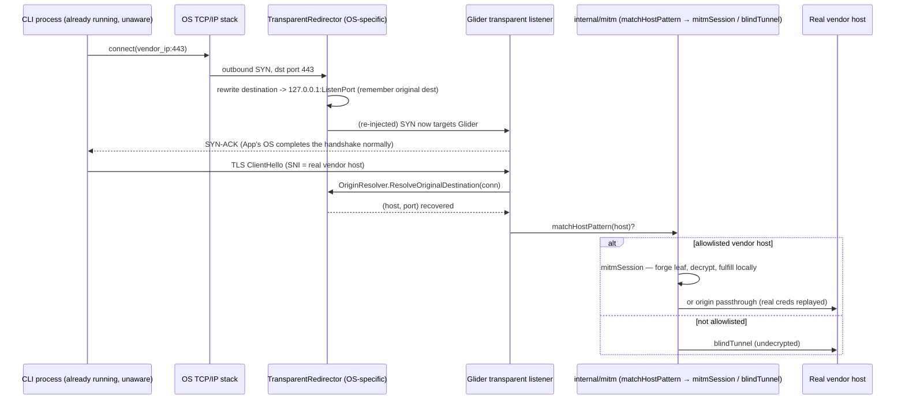

# Transparent redirector — interface design and mechanics

How Glider intercepts a CLI's HTTPS traffic without that CLI cooperating in any way — no proxy setting, no env var, no relaunch — and why the interface is split the way it is. Windows (WinDivert) and Linux (iptables + `SO_ORIGINAL_DST`) both shipped and live-verified; macOS designed but not built. Code: `internal/mitm/redirector_windows.go`, `internal/mitm/redirector_linux.go`, `internal/mitm/redirector_other.go` (macOS/other stub).

## The one-paragraph mental model

Every cooperative way Glider gets in front of traffic — a proxy setting, a base-URL override — works because the client **agrees to ask Glider first**. That's a favor, and it has a real limit: it only takes effect for a process that hasn't started yet, so it can never reach a CLI session someone already has open. A transparent redirector doesn't ask for the favor. It sits at the one layer no application can opt out of — the OS's own decision about where a port-443 packet actually goes — and answers that question itself, for every process already running or not, the instant Glider turns on. The interface is deliberately thin: its entire job is "get the bytes to Glider instead of the real host." What happens to those bytes once they arrive — host allowlist match, forge a cert, decrypt, fulfill locally or pass through — already exists in `internal/mitm` and doesn't change based on which OS-level trick got the bytes there.

## What this interface solves, and what it deliberately doesn't

**Solves:** landing an outbound connection a CLI opened to an allowlisted vendor host on a socket Glider controls, without the CLI's cooperation, regardless of when that process started.

**Explicitly not this interface's job** (already solved elsewhere, would be duplicated code otherwise):

| Already solved by | Not the redirector's job |
|---|---|
| `internal/mitm/hosts.go` (`matchHostPattern`) | Deciding which hostnames are worth decrypting |
| `internal/mitm/proxy.go` (`mitmSession`) | Forging a leaf cert, completing TLS, running the harness pipeline |
| `internal/mitm/proxy.go` (`blindTunnel`) | Passing non-matched traffic straight through |
| `internal/router`, `internal/orchestrator` | Local vs. cloud vs. delegate |

The redirector's whole contract: hand `mitmSession`/`blindTunnel` a normal, already-accepted `net.Conn`, plus the answer to "what host was this connection actually trying to reach" — the one piece of information a transparent path doesn't get for free the way a CONNECT-based path does (a `CONNECT host:443` request line states it outright).

## The interface

```go
// TransparentRedirector owns exactly one OS-specific fact: how to make outbound
// connections to MatchPorts land on ListenPort instead of their real destination.
// It knows nothing about TLS, hosts, or routing — that's what makes it swappable
// per OS without touching anything downstream.
type TransparentRedirector interface {
	Start(ctx context.Context, cfg RedirectConfig) error
	// Stop must fully undo whatever Start did — no leftover kernel state, no
	// orphaned driver, no dangling firewall rule.
	Stop() error
}

type RedirectConfig struct {
	ListenPort int   // Glider's local transparent-ingress port (e.g. 8083)
	MatchPorts []int // destination ports to intercept — []int{443} today
}

// OriginResolver answers the question a transparent path can't get for free:
// given a connection that already landed on Glider's listener, what host/port
// was the client actually trying to reach?
type OriginResolver interface {
	ResolveOriginalDestination(conn net.Conn) (host string, port int, err error)
}
```

Split into two interfaces rather than one call because their frequency differs (`Start`/`Stop` once at startup/shutdown; `ResolveOriginalDestination` on every accepted connection) and their per-OS cost is wildly asymmetric — Linux's resolver is nearly free (one syscall), Windows' requires the redirector to keep its own bookkeeping (below). `RedirectConfig` stays host-unaware on purpose: host-level policy already lives in `matchHostPattern`, once; teaching the redirector about hosts would mean two places decide "is this host interesting."

## Steady state, once running



The load-bearing detail: from `App`'s perspective nothing here happened — it called `connect()` once, got a handshake, sent its ClientHello. It didn't need to be launched by Glider or read an env var Glider set.

## Windows (WinDivert) — shipped

```
Original IPv4 packet (SYN, client -> vendor_ip:443):
  WinDivertRecv() delivers it to Glider's redirector before the OS sends it
                        │
                        ▼
  rewrite dst -> 127.0.0.1:ListenPort
  record {src_ip:src_port -> vendor_ip:443} in an in-process flow table
  WinDivertHelperCalcChecksums() (IP+TCP checksums cover the fields just changed)
                        │
                        ▼
  WinDivertSend() reinjects — client's own TCP stack thinks it opened a
  connection to vendor_ip:443; it never sees the rewrite.
```

Windows has no OS-native "original destination" lookup, unlike Linux — the flow table above is the redirector's own responsibility, keyed by the client's source `ip:port` (constant across the rewrite, and what `conn.RemoteAddr()` sees on the accepted socket). `ResolveOriginalDestination` on Windows is a map lookup against that table. Open item: eviction policy (TTL-on-insert + removal on `conn.Close()` is the obvious shape, not yet built — a long-lived entry needs to survive as long as the connection, but an ever-growing table is a leak).

Live-verified: a sniff-mode capture (`WINDIVERT_FLAG_SNIFF | WINDIVERT_FLAG_RECV_ONLY`, no packets touched) caught 712 real outbound TLS segments system-wide in 25s, including an already-running Claude Code session's own traffic — proving visibility into pre-existing connections with zero app cooperation. `Stop()` was verified to leave no trace (`sc query` confirms the driver service is fully gone after `sc delete`).

## Linux (iptables + `SO_ORIGINAL_DST`) — shipped, live-verified 2026-07-30

```
iptables -t nat -N GLIDER_TRANSPARENT
iptables -t nat -A GLIDER_TRANSPARENT -d <allowlisted-ip> -p tcp --dport 443 -j REDIRECT --to-port <ListenPort>
iptables -t nat -A OUTPUT -j GLIDER_TRANSPARENT
```

`REDIRECT` is a first-class netfilter target — the kernel rewrites the destination before the packet leaves the machine, no userspace rewrite-and-reinject round trip. `OriginResolver` is `getsockopt(fd, SOL_IP, SO_ORIGINAL_DST)` on the accepted socket — the kernel hands back the pre-NAT destination directly, no flow table or eviction policy needed (unlike Windows). `redirector_linux.go` implements this.

Genuinely, architecturally different from Windows, not just a different syscall set for the same shape: WinDivert operates per-*packet*, so `handlePacket` has to make (and, on 2026-07-30, got wrong once — see that function's own doc comment in `redirector_windows.go` for the live incident) a redirect decision on every single packet of a connection. `REDIRECT` operates per-*connection* — the kernel commits to the redirect once, before Glider's listener ever sees anything, so there is no packet-level decision to make at all on this platform, and therefore no equivalent of that bug class is even possible here by construction.

One real capability gap this creates: Netfilter's `REDIRECT` target has no "match by owning process image name" condition the way WinDivert's own packet filter can express directly, so `AllowProcessNames` can't be enforced by the firewall rule itself. It's enforced instead in `internal/mitm/proxy.go`'s shared `handleTransparent`, via the new optional `ProcessFilter` interface (`ConnectionAllowed(conn) bool`) — checked once per accepted connection, using the exact same `/proc/net/tcp` + `/proc/<pid>/fd` technique `ss`/`netstat` use (`internal/procinfo/procinfo_linux.go`) to answer "who owns the other end of this socket," mirroring Windows' `GetExtendedTcpTable`-based `ownerPID` (same bounded-retry-on-cold-cache defense against the same kernel-propagation-delay race documented above, ported proactively rather than re-discovered live on this platform too). A connection whose owning process isn't allowlisted gets blind-tunneled to the real destination unconditionally — Linux has no way to "un-redirect" a connection after the kernel already completed the handshake against Glider's own socket, so this is the connection-oriented equivalent of Windows reinjecting a rejected packet unchanged.

Live-verified inside WSL2 Ubuntu 24.04, kernel `6.6.87.2-microsoft-standard-WSL2`: a real `iptables -t nat` `REDIRECT` rule against a real local listener correctly diverted a real outbound `net.Dial` connection before it ever reached the real destination (confirmed by the "real destination" listener never receiving a direct connection), and `SO_ORIGINAL_DST` correctly recovered the original address — including the network-byte-order port fix (the same `MIB_TCPROW_OWNER_PID`-style byte-swap issue Windows' owner-table parsing already has to handle, ported here for the analogous reason). Self-traffic exclusion (Glider's own outbound dials never redirected back into itself) verified against a real connection too. This directly contradicts an earlier note in this doc claiming WSL2's stock kernel ships without netfilter's NAT modules compiled in — either that was true of an older WSL2 kernel build and has since been fixed upstream, or it was a misdiagnosis of a different problem at the time; either way, the current kernel demonstrably has full NAT support. `Stop()`'s teardown (chain flush + delete, OUTPUT jump removal) verified to leave no trace via `iptables -t nat -L`.

A real, more severe risk than WinDivert's, documented directly in `redirector_linux.go`: iptables rules are persistent kernel state, not tied to the process the way a WinDivert handle is. If Glider crashes before `Stop()` runs, the `REDIRECT` rule stays active indefinitely — silently blackholing traffic to a port nothing is listening on anymore — until something manually clears it. `setupIPTables` defends against a stale rule from a *previous* crashed run (idempotent cleanup before creating anything), but there's no defense against *this* run crashing uncleanly. Same category of incident as the WinDivert orphaned-rule postmortem elsewhere in this project's history, worse in that there's no OS-level handle-close-on-exit to fall back on at all — anyone touching this code needs the same watchdog/cleanup/network-health-check discipline WinDivert testing already requires, not implicit trust that a crash is safe.

## macOS — documented only, no hardware tested

Apple's Network Extension framework (`NETransparentProxyProvider`/`NEFilterDataProvider`) is the supported, notarizable API for this; `pfctl` NAT `rdr` rules are the lower-level fallback (what mitmproxy/Charles already use there). No live evidence either way — nothing implemented.

## Side-by-side

| | `Start`/`Stop` | `ResolveOriginalDestination` | `AllowProcessNames` | Confidence |
|---|---|---|---|---|
| **Windows** | WinDivert: rewrite + checksum + reinject; `Stop` closes the handle and waits for the workers | In-process flow table keyed by client `ip:port` | Packet-level, pre-accept (`ownerPID`/`processAllowed` in `handlePacket`) | **Proven live** |
| **Linux** | `iptables` `REDIRECT` in a dedicated chain; `Stop` flushes and deletes it | `SO_ORIGINAL_DST` — free from the kernel | Connection-level, post-accept (`ProcessFilter`/`ConnectionAllowed`, since `REDIRECT` has no process-match condition) | **Proven live** (WSL2 Ubuntu 24.04, kernel 6.6.87.2) |
| **macOS** | Network Extension framework, or `pfctl` `rdr` | Provided by the framework, or BSD original-destination lookup | Not designed yet | Documented only |

Selected by Go build tag (`redirector_windows.go` / `redirector_linux.go`), not runtime dispatch — a platform without an implementation simply doesn't compile that code in. `redirector_other.go` (`!windows && !linux`) is the honest macOS-and-anything-else stub — it errors clearly rather than silently no-opping.

## Does the CLI actually trust Glider's forged cert?

Routing and TLS trust are independent failure modes — WinDivert can redirect a connection perfectly and the handshake can still fail if the client doesn't trust Glider's CA. Tested for Claude Code: minted a real leaf (signed by Glider's own CA, already in the OS Trusted Root store from Cursor setup), pointed `ANTHROPIC_BASE_URL` at a local test server presenting it, ran `claude -p` from a shell with `NODE_EXTRA_CA_CERTS` explicitly unset. The handshake completed and the real request landed.

**Claude Code's bundled Node runtime trusts the OS certificate store directly** — it does not need the `NODE_EXTRA_CA_CERTS` cooperation step Cursor's Electron/Node stack does (see `docs/MITM_NETWORK.md`'s CA setup, which requires exactly that env var for Cursor). This matters because CA trust for Claude Code is then a one-time, system-level action (install into Trusted Root once), not a per-process env var — so it doesn't inherit the "only affects processes launched after Glider starts" problem that rules out `ANTHROPIC_BASE_URL` as a transport in the first place. Combined with the redirector, both halves of interception (routing the bytes, and having them trusted once decrypted) are cooperation-free and retroactive for Claude Code specifically. Cursor's TLS-trust half is still env-var-shaped, so it keeps the "already-open session" caveat on the trust side that Claude Code doesn't have.

Not tested: `cursor-agent`'s and `agy`'s TLS-trust behavior specifically (as opposed to Cursor IDE's, which the MITM docs already cover).

### The driver service outlives the process

`WinDivertRedirector.Stop` calls `WinDivertClose` on the handle and waits for
the workers. It does **not** stop or delete the `WinDivert` driver service.
Closing the handle is what removes the filters, so traffic returns to normal
immediately and this is not a functional leak — confirmed live on 2026-08-13
after a clean tray exit: a real TLS fetch to `api.anthropic.com` reached the
true origin, while `sc query WinDivert` still reported `STATE = RUNNING`.

Two consequences, both worth knowing before they mislead somebody:

1. **`sc query WinDivert` does not answer "is Glider intercepting?"** The
   service stays loaded until it is stopped or the machine reboots. The
   honest test is whether a real TLS request reaches the true origin.
2. **It is residue on uninstall**, in the same family as the CA left in the
   trust store. A kernel driver service that a user did not knowingly install
   should not outlive the app that installed it.

Not fixed here on purpose. Adding service teardown to `Stop` is a change to
the WinDivert lifecycle, which is the one place in this codebase where a wrong
edit takes the network down rather than the build. It wants its own supervised
change with a reboot-free rollback path, not a drive-by.

## Open questions

- **IPv6** — the Windows packet parser only handles IPv4 headers today; an IPv6-resolved vendor host needs a second parser, not designed yet.
- **Encrypted ClientHello (ECH)** — everything above assumes the transparent listener can read a plaintext SNI. Not observed for the three vendors so far; if it appears, `OriginResolver` stops being "the Windows answer, redundant on Linux" and becomes the only source of truth for host on every OS.
- **Windows flow-table eviction** — noted above, not yet built.
- **System-wide vs. process-scoped matching** — everything above redirects system-wide (every process's port-443 traffic). A narrower alternative (a connect-hook DLL injected into one launched process, à la Proxifier/proxychains4) is the fallback if system-wide interception ever proves too broad for a given deployment — not adopted, kept in the design space.

## Integration point

- `internal/mitm/redirector_windows.go` (`//go:build windows`) implements both interfaces via WinDivert; `redirector_other.go` is the no-op stub on other platforms.
- A transparent-ingress path alongside `handleCONNECT` peeks the TLS ClientHello for SNI (falling back to `OriginResolver` if absent), then dispatches into the same `matchHostPattern` → `mitmSession`/`blindTunnel` sequence `handleCONNECT` already uses — no changes to either of those functions.
- Lifecycle: gated by `mitm.transparent` in config, started/stopped alongside Glider's other listeners in the server's own run context.
